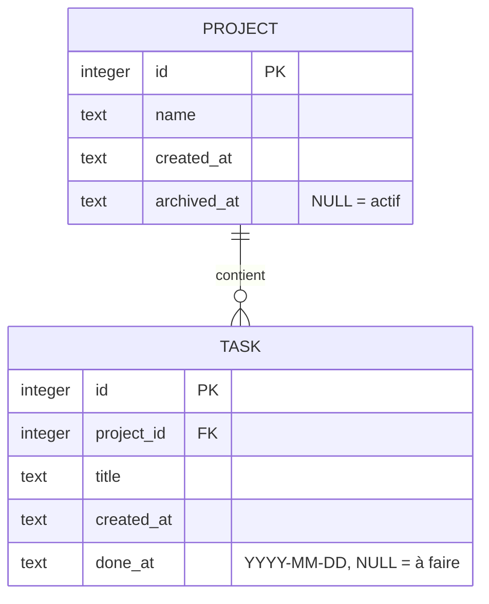

# Tâches

Gestionnaire de tâches par projet, avec journal quotidien de ce qui a été fait.
HTML / CSS / vanilla JS côté navigateur, petit serveur Node + SQLite, **zéro dépendance**.

## Lancer

```sh
node --version   # >= 22.13 (module node:sqlite intégré)
npm start        # http://localhost:3000
npm test
```

Variables d'environnement :

| Variable   | Défaut           | Rôle                    |
|------------|------------------|-------------------------|
| `PORT`     | `3000`           | Port HTTP               |
| `TASKS_DB` | `data/tasks.db`  | Chemin du fichier SQLite |

## Utilisation

- Clic sur un nom de projet ou de tâche → champ d'édition ; `Entrée` valide, `Échap` annule.
- Cocher une tâche → elle part dans le journal, datée du jour. La décocher → retour dans son projet.
- Journal : par défaut, la dernière journée travaillée. Filtres par date et/ou par projet
  (un projet seul → toutes les journées où une de ses tâches a été faite).
- Survol d'une tâche faite → bouton `date` pour corriger sa date.
- Archiver un projet le masque (case « Archivés » pour le revoir) ; son historique reste dans le journal.
- **Exporter** télécharge le fichier `.sqlite` complet ; **Importer .sqlite** remplace toute la base.

### Raccourcis

| Touche | Action |
|--------|--------|
| `p` | Nouveau projet |
| `n` | Nouvelle tâche (dernier projet utilisé) |
| `d` / `f` | Filtre date / projet du journal |
| `Échap` | Annuler l'édition, réinitialiser les filtres |
| `?` | Aide |

### Import markdown

Ajoute (sans rien effacer) projets et tâches depuis un fichier au format :

```md
- Projet A
  - tâche à faire
- Projet B

## 24/09/2026
- Projet A
  - [x] tâche faite ce jour
- tâche sans projet
```

- Puce de niveau 0 = projet, sous-puce = tâche. Cases `[ ]` / `[x]` ignorées.
- Toute ligne contenant une date (`2026-09-24`, `24/09/2026`…) ouvre une journée : ce qui suit est « fait » à cette date.
- Tâche faite sans projet → projet « Sans projet ». Projets existants réutilisés (même nom, casse ignorée).

## Modèle de données

MCD : un projet contient 0..n tâches ; une tâche appartient à exactement 1 projet.
Le journal n'est pas une table : c'est la vue des tâches dont `done_at` est renseigné.



- Suppression d'un projet → ses tâches aussi (`ON DELETE CASCADE`).
- Version du schéma dans `PRAGMA user_version` ; migrations dans `src/db.js`.

## API

| Méthode | Route | Corps / params |
|---------|-------|----------------|
| GET | `/api/state` | projets + tâches à faire |
| GET | `/api/journal` | `?date=YYYY-MM-DD` et/ou `?project=id` |
| POST | `/api/projects` | `{ name }` |
| PATCH | `/api/projects/:id` | `{ name?, archived? }` |
| DELETE | `/api/projects/:id` | |
| POST | `/api/tasks` | `{ project_id, title }` |
| PATCH | `/api/tasks/:id` | `{ title?, done?, done_at? }` |
| DELETE | `/api/tasks/:id` | |
| GET | `/api/export` | fichier `.sqlite` |
| POST | `/api/import` | fichier `.sqlite` brut (remplace tout) |
| POST | `/api/import-markdown` | texte markdown (ajoute) |
